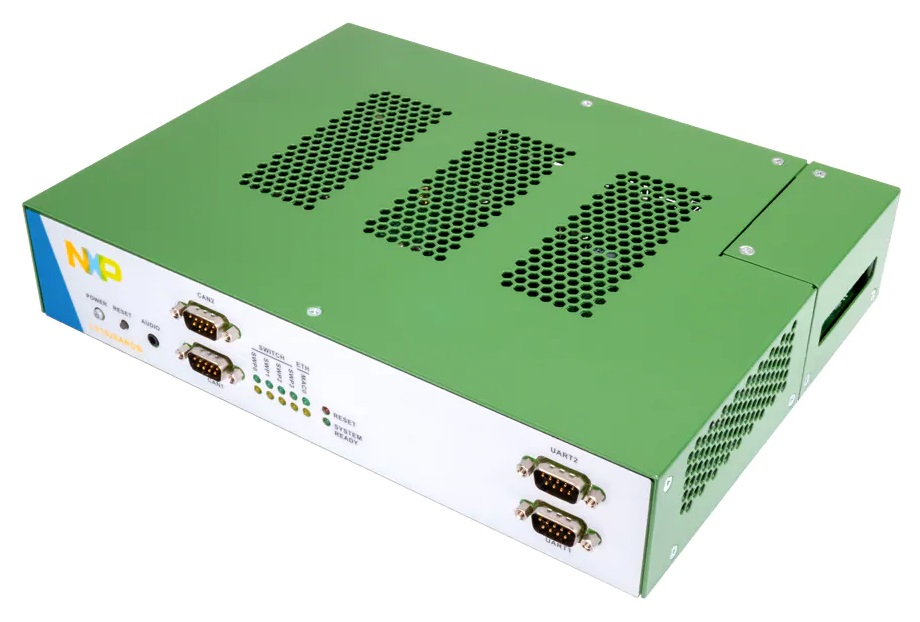

# meta-tanowrt-hsl-nxp

[TanoWrt](https://github.com/tano-systems/meta-tanowrt) hardware support layer for the NXP (Freescale) boards.

## Supported Hardware

| `MACHINE`        | Board(s)                                                                                                           |
| ---------------- | ------------------------------------------------------------------------------------------------------------------ |
| `nxp-ls1028ardb` | [NXP LS1028A RDB board](https://www.nxp.com/design/qoriq-developer-resources/ls1028a-development-board:LS1028ARDB) |

## Supported Images

| Recipe               | Image                          |
| -------------------- | ------------------------------ |
| `tanowrt-image-full` | Full TanoWrt image             |

## Prerequisites

Follow the instructions outlined in "[Prerequisites](../README.md#Prerequisites)" section of the root README.md.

## Initialize Repositories

Create a working directory (this document uses `~/tanowrt` for example):
```shell
mkdir -p ~/tanowrt
```

Go to the created working directory and execute repo tool:
```shell
cd ~/tanowrt
repo init -u https://github.com/tano-systems/meta-tanowrt \
          -m meta-tanowrt-hsl-nxp/manifests/tanowrt.xml \
          -b master
```

Synchronize all repositories by executing a command:
```shell
repo sync
```

## Initialize Build Environment

Go to the working directory (`~/tanowrt`):
```shell
cd ~/tanowrt
```

You should see the following working directory tree:
```
.
├── bitbake
├── build
├── LICENSE
├── LICENSE.GPL-2.0-only
├── LICENSE.MIT
├── meta
├── meta-openembedded
├── meta-freescale
├── meta-selftest
├── meta-skeleton
├── meta-tanowrt
├── oe-init-build-env
├── README.LSB
├── README.OE-Core
├── README.qemu
└── scripts
```

The first time you need to add layers and create `local.conf` from the template. To do this, run the command:
```shell
TEMPLATECONF=meta-tanowrt/meta-tanowrt-hsl-nxp/templates . ./oe-init-build-env
```

This command automatically creates a `build` subdirectory with the required configuration (`local.conf` and `bblayers.conf`) based on the specified template.

If the `build` subdirectory with configuration has already been created, this command can be used to initialize build environment (without specifying a template directory):
```shell
. ./oe-init-build-env
```

After executing `oe-init-build-env` script, the current directory will be automatically changed to `build` subdirectory of the working directory. Any build commands must be always run from the `build` subdirectory.

## Freescale EULA

To build any images with this layer you need to read and accept the Freescale EULA located in the `EULA` file at the root of the `meta-freescale` layer (`~/tanowrt/meta-freescale/EULA`).

If you accept the Freescale EULA, you must manually add the following line to `local.conf` file (`~/tanowrt/build/conf/local.conf`):

```
ACCEPT_FSL_EULA = "1"
```

## Building

Build SD card image for Raspberry Pi 3 Model B or B+ board as an example:

```shell
MACHINE=nxp-ls1028ardb bitbake tanowrt-image-full
```

When the build is complete, the SD card image file will be located in folder
```
./tanowrt-glibc/deploy/images/nxp-ls1028ardb/tanowrt-image-full-nxp-ls1028ardb.sdcard.img
```

All images supported by this layer are listed in the "[Supported Images](#Supported-Images)" section.

Other available machines are listed in the "[Supported Hardware](#Supported-Hardware)" section.

## Running on Hardware

### LS1028A RDB Board (`nxp-ls1028ardb`)



#### Write Bootable SD Card

Go to the deploy directory:

```shell
cd tanowrt-glibc/deploy/images/nxp-ls1028ardb
```

Use the `dd` utility to write the generated `.sdcard.img` image to the SD card (256 MiB or larger). For example:

```shell
dd if=tanowrt-image-full-nxp-ls1028ardb.sdcard.img of=dev/mmcblk0 bs=512
```

#### Prepare Hardware

Set the DIP switches on the board as follows ('0' is OFF, '1' is ON):

| DIP switch | Setting   |
| ---------- | --------- |
| SW2[1:8]   | 1000 1000 |
| SW3[1:8]   | 1111 0000 |
| SW5[1:8]   | 0011 1001 |


#### Booting

Insert the prepared SD card into the slot on the LS1028A RDB board and turn it on. You can access to the system console over UART1 port. For login use credentials specified in "[Access](#Access)" section.

#### Default Network Configuration


By default, network ports SWP0, SWP1, SWP2 and SWP3 are joined into a bridge (`br-lan` interface) with the RSTP protocol enabled. Bridge 'br-lan ' is in the LAN firewall zone. By default, the IP address on the `br-lan` bridge is configured using a DHCP client.

The web-configuration interface can be accessed via any of the SWP0–3 ports through HTTP(s) protocol. You must see something like this in browser:


The network port MAC0 (interface `eno0`) is a separate network interface included in the WAN firewall zone with enabled translation (NAT) from LAN zone. The IP address of the `eno0` interface is also configured with a DHCP client. A firewall with blocking rules for incoming traffic is enabled on the `eno0` interface. Therefore, there is no access to the web configuration interface through this interface.

## Access

The following credentials are used to access the operating system (terminal) and the LuCI web-configuration interface:
* User name: `root`
* Password: `root`

## Dependencies

This layer depends on the [meta-tanowrt](../meta-tanowrt/README.md) layer (TanoWrt Linux distribution core layer) with all its dependencies.

Additional dependencies are listed here:

* meta-freescale  
  URI: <git://git.yoctoproject.org/meta-freescale>  
  Branch: master

The current exact revisions of all listed dependencies are given in [manifests/deps.xml](manifests/deps.xml).

## License

All metadata is MIT licensed unless otherwise stated. Source code included in tree for individual recipes is under the LICENSE stated in each recipe (.bb file) unless otherwise stated.

## Maintainers

Anton Kikin <a.kikin@tano-systems.com>
